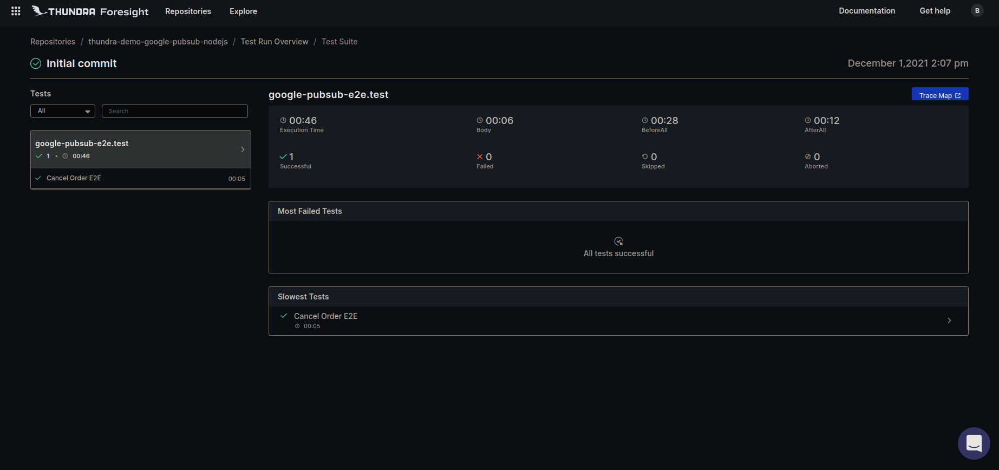
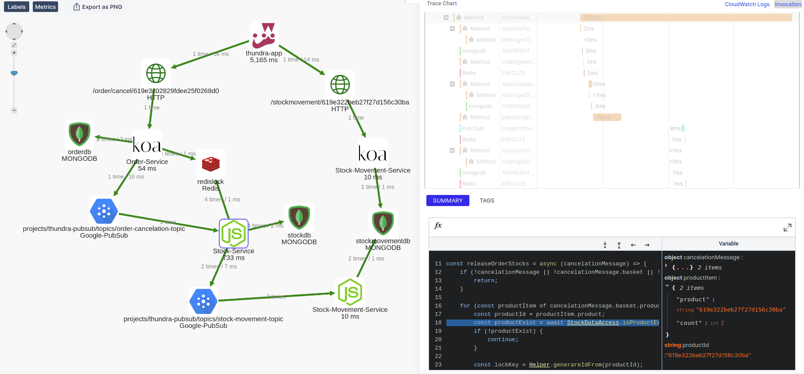

# Thundra Node.js Goolge PubSub Demo

Simple Node.js demo application deployed to Docker and monitored/traced by Thundra

## Prerequisites

* Docker
* Docker Compose
* Node.js / `npm`
* `make`

## Preparing For Run

Install the dependencies using this command:
```
make install
```

Buld docker images using this command:
```
make build
```

Set your Thundra API key and project id into `Makefile`
```
export THUNDRA_APIKEY = <YOUR-THUNDRA-API-KEY-HERE>
export THUNDRA_AGENT_TEST_PROJECT_ID = <YOUR-THUNDRA-PROJECT-ID-HERE>
```

## Running the Tests

You don't need to start the application to run the tests. You can simply run the following command.

```
make test
```

This will run the tests.


### Results

If you set the `THUNDRA_APIKEY` and `THUNDRA_AGENT_TEST_PROJECT_ID` in the `Makefile`, Thundra Foresight and APM should show the following results.

#### Thundra Foresight Testrun Detail



#### Thundra APM Trace Map



